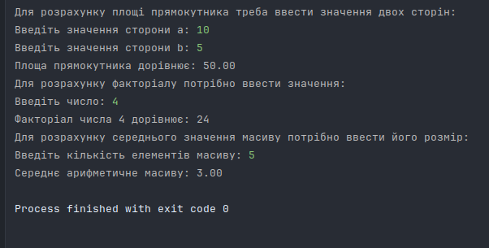

<h1 align="center">ЛАБОРАТОРНА РОБОТА №4</h1>
<h3 align="center">Тема: Основи мови С </h3>
<h3 align="center">Виконав:	Желобецький Арсеній Павлович; група 6.1221</h3>

## Завдання:

Завдання 1
Напишіть програму, яка обчислює площу прямокутника за допомогою змінних для довжин сторін.

Завдання 2
Напишіть функцію для обчислення факторіалу числа.

Завдання 3
Створіть програму для обчислення середнього значення масиву чисел.

<h3 align="center">Результат:</h3>

  

